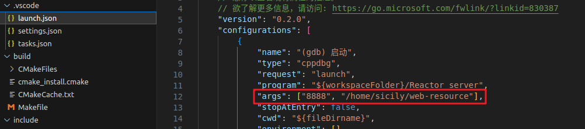
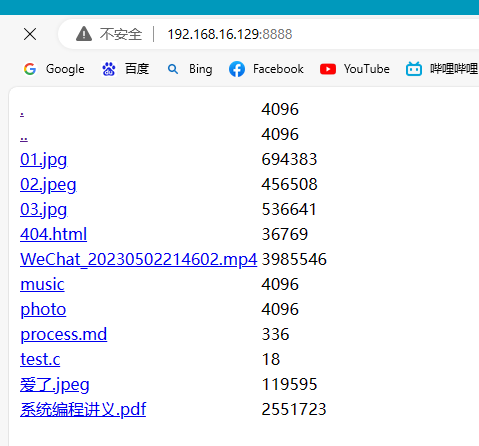

# HTTP-Reactor-C

### 介绍

轻量级的 Http 高并发服务器

单 Reactor 多线程方案 + epoll 模型中边沿非阻塞模式

### 运行

#### 使用 cmake 加 make构建，编译和调试

- 新建一build目录

- 进入build目录
- 执行  `cmake..` 

- 执行  `make` ，得到可执行文件 Reactor_server
- 执行 `../Reactor_server 端口号 展示的目录`（此时在build文件夹下，生成的可执行文件Reactor_serve在上一层）

```shell
mkdir build
cd build/
cmake..
make
../Reactor_server 端口号 展示的目录
```

#### VSCode运行调试

如果vscode安装了cmake，可以修改.vscode下launch.json的args为自定义端口号和展示目录



直接vscode下进行F5调试运行。

### 结果示例



